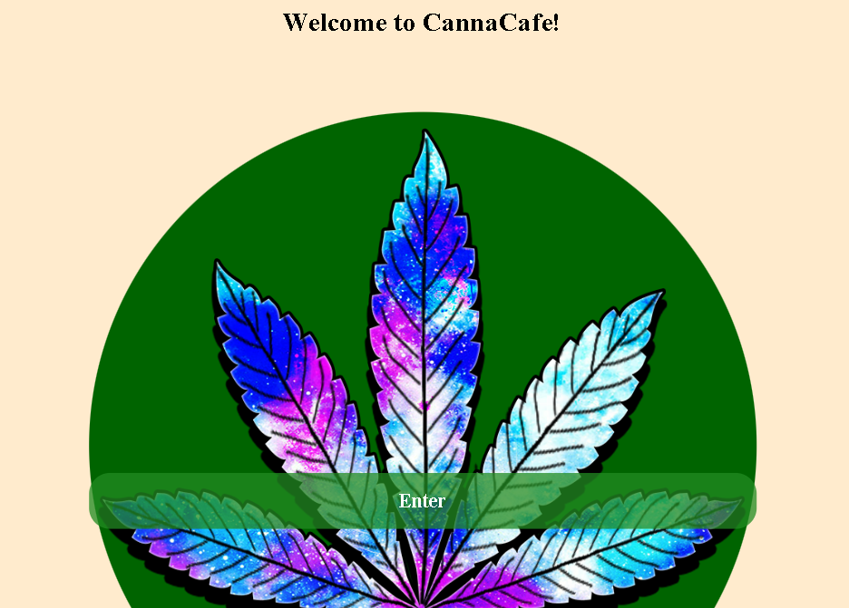
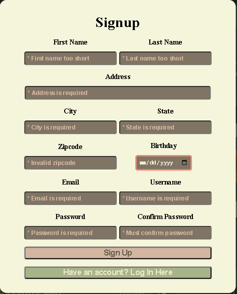
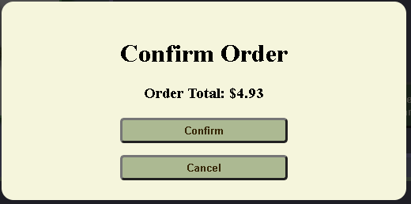
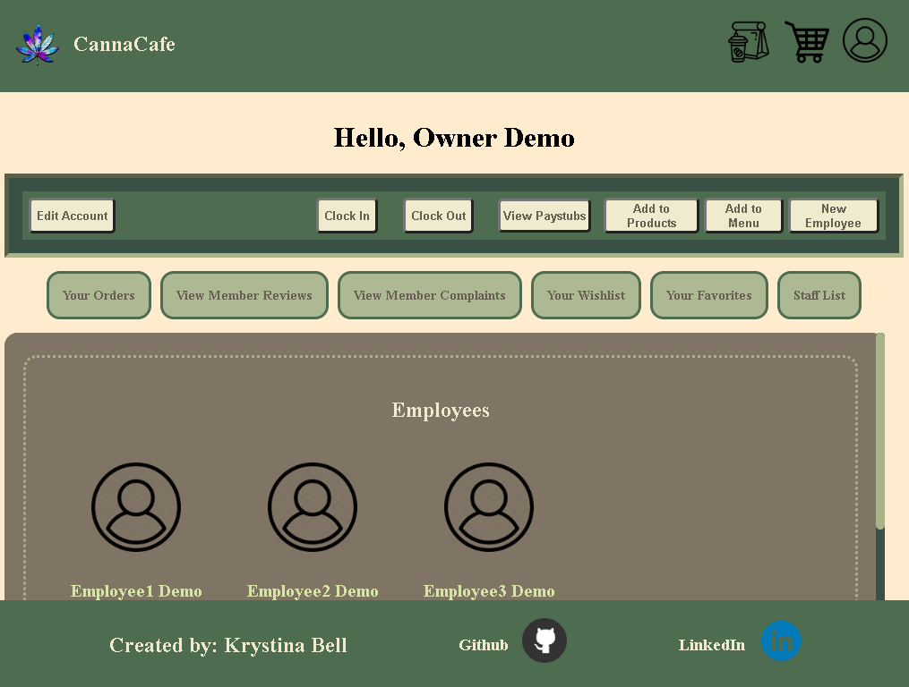
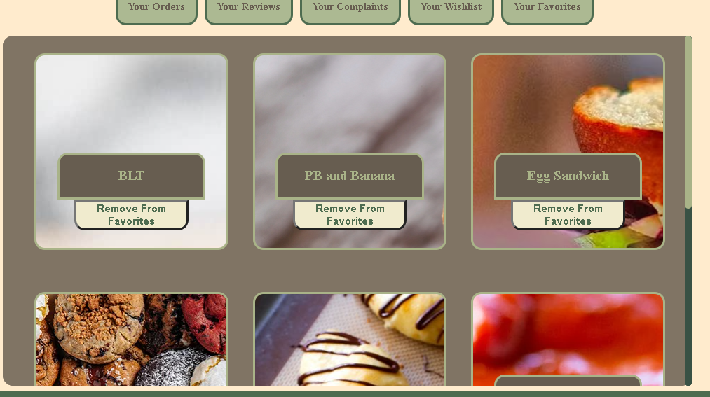

# [CannaCafe]("https://www.cannacafe.onrender.com")

Your One Stop Shop For All Things Relating To Cannabis
Welcome to CannaCafe, the place where your inner child can finally be let loose! This platform is a lively online shop designed for fellow lovers and connoisseurs of the amazing and weirdly controversial herb with calming and healing properties. If you're passionate about the potent and smelly healing herb and an opposer to the government imposed hate directed at the kind and lovely sweetheart that is Cannabis, CannaCafe is the place for you.

## Table of Contents

- [CannaCafe](#cannacafe)
  - [Table of Contents](#table-of-contents)
  - [General info](#general-info)
  - [Languages, Frameworks, and Tools](#languages-frameworks-and-tools)
  - [Setup](#setup)
  - [Quick Tour](#quick-tour)
    - [Sign-Up Modal](#sign-up-modal)
    - [Log In Modal](#log-in-modal)
    - [Home Page](#home-page)
    - [Products](#products)
    - [Place Order](#place-order)
    - [User Profile](#user-profile)
  - [Documetation](#documetation)
  - [Current Features](#current-features)
  - [Future Plans](#future-plans)

## General info

CannaCafe will be a versatile platform seamlessly integrating staff management, e-commerce, and restaurant functionalities. Tailored for businesses, it offers robust staff management tools, ensuring efficient organization. Members enjoy a user-friendly e-commerce and restaurant frontend, streamlining their experience. Additionally, our age-restricted displays provide a secure environment for guests, enhancing user safety and compliance.

## Languages, Frameworks, and Tools

    Python
    JavaScript
    HTML
    CSS
    Flask
    React
    Docker
    AWS
    Node.js
    NPM

## Setup

Startup Backend - from the root of this repository, run the following in the terminal:

- pipenv install -r requirements.txt && pipenv shell
- flask db upgrade && flask seed all && flask run

Startup Frontend - from the file frontend, make sure you are using nvm v16 then run the following in the terminal:

- npm install
- npm start

## Quick Tour

### Sign-Up Modal

Signup Error Handling

Birthday is also a requirement (styling to display this will be added soon)

### Log In Modal

### Home Page

After clicking the Enter button on the splash page youll be brought here. You can roam as a guest, sign up, or log in.

Roaming as a guest, you can till view some products (non-age-restricted products only) & place orders (takeout & cart)

Logged out:

Logged in - Member and Base level Employees:

Logged in - Management (roles: Manager and Owner)

### Products

Products rendered by clicking the "Food" button - as viewed by Management

Products rendered by clicking on the "View All Products button" - as viewed by Member or base level Employee

### Place Order

The shopping cart and the takeout bag are styled extremely similarly - Displayed is the shopping cart

The checkout modals are a tad different however...

The checkout modal for the takeout bag, requires you to select an option

Where-as the shopping cart checkout does not

### User Profile

Member

- User's Reviews
  

Employee

Management

- All users' reviews
  

Universal

- Favorites
  
- Wishlist
  
- Past Orders
  

This is is just scratching the surface, there is more to explore and much much more to come. In the mean time, the most current stable version is running [HERE](cannacafe.onrender.com) for you to test out 😊

## Documetation

[Backend Docs](https://github.com/Lillith13/CannaCafe/wiki/Backend-Documentation)

- Last updated: 11/29/2023

[Frontend Docs](https://github.com/Lillith13/CannaCafe/wiki/Frontend-Documentation)

- Last updated: 11/28/2023

[All Current Screenshots](assets/)

- Last updated: 12/24/2023

## Current Features

<!-- group by most universally accessible to least -->

| Minimum Role Requirment | Feature Available                                   |
| ----------------------- | --------------------------------------------------- |
| Guest                   | Read Products/MenuItems (filtered - age-restricted) |
|                         | Read/Update Shopping Cart                           |
|                         | Read/Update Takeaway Bag                            |
| Member                  | Read Products/MenuItems (all)                       |
|                         | Create/Read/Update/Delete Reviews\*                 |
|                         | Create/Read/Update/Delete Orders                    |
|                         | Read/Update Wishlist (Shippable Products)           |
|                         | Read/Update Favorites (Menu Items)                  |
|                         | Create/Read/Update/Delete Account &&\*              |
| Employee                | Create/Update (Clock in/out) Timecard               |
|                         | Read (Paystubs) Timecards                           |
|                         | View coworker contact info                          |
| Management              | Create/Read/Update/Delete products/menu items       |
|                         | View ALL posted reviews                             |
|                         | Create/Update Employee Accounts\*\*                 |

\* Create/Update/Delete Reviews is Exclusive to users with "Member" role

&&\* Delete Account is Exclusive to users with "Member" role

\*\* BUT! ->

- Only Owners have full access to create/update all staff.
- Managers cannot create/update other managers nor can they create/edit owner accounts.

\^ Paystubs in the form of per day worked pay

## Future Plans

Implement user complaints. Similar to reviews but will be for in general complaints a member may have about anything from shipping to customer service. These will be only viewable by management staff (Managers & Owners) and the user who submitted the complaint.

Add a small dash of social media in the mix by adding the ability for users to connect/friend one another. Piggy backing off this feature will come events. Where a user can reserve for an event and upon reservation there will be a notification sent to all users that fall into a spcific categories pertaining to the event (such as "event = private, notify only friends").

Connect maps to better develop the shopping cart, takeout features, complaints, friends, and events features.

- Piggybacking off of the new connection to maps, all features will be redesigned to incorporate location. Management staff will begin to see only the complaints and reviews for the products from their specific location. Notifications will gain new filter of location. Events will get a new modifier of location and friend suggestions will become a thing.

Add user ability to DM each other

Add community forums

- Specifically for:
  - Q&As/FAQs
  - Event Planning / Event Details

Add scheduling to staff pages

- Management ability to set/edit schedules notifying all other staff at that location
- Employee ability to view schedule (their own and coworkers) and request days off

Themes

Restyling to accomodate various screen sizes and browsers

...figure out how to make this into a downloadable software and then app for mobile devices 😊
